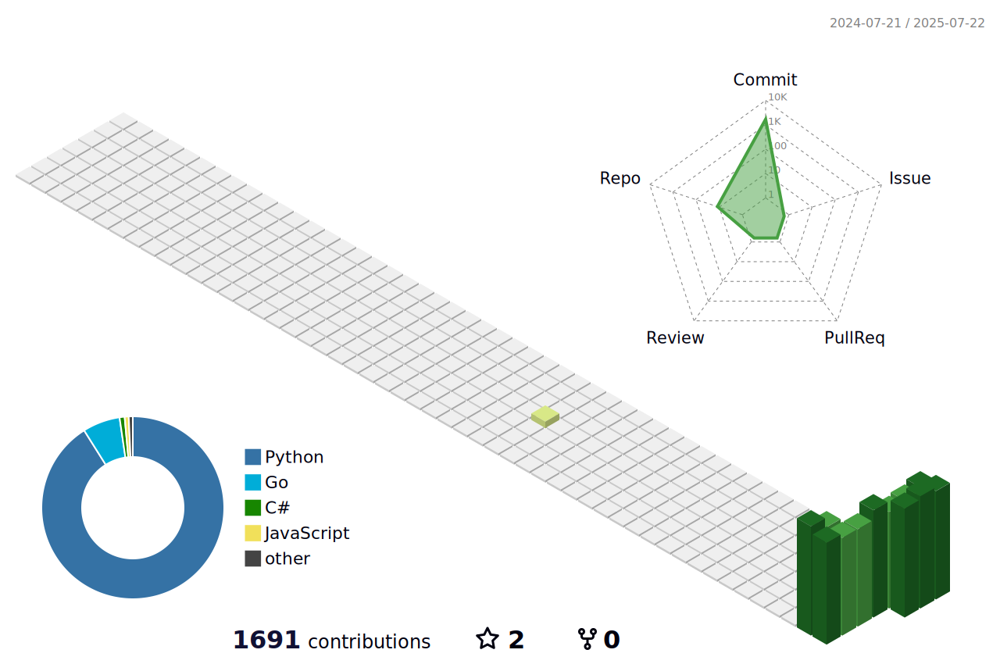

<!--
**tahmaseb73/Tahmaseb73** is a ✨ _special_ ✨ repository because its `README.md` (this file) appears on your GitHub profile.

Here are some ideas to get you started:

- 🔭 I’m currently working on ...
- 🌱 I’m currently learning ...
- 👯 I’m looking to collaborate on ...
- 🤔 I’m looking for help with ...
- 💬 Ask me about ...
- 📫 How to reach me: ...
- 😄 Pronouns: ...
- ⚡ Fun fact: ...
-->

  <picture>
    <source media="(prefers-color-scheme: dark)" srcset="profile-3d-contrib/dark-theme.svg">
    <source media="(prefers-color-scheme: light)" srcset="profile-3d-contrib/light-theme.svg">
    
  </picture>

### 🌍 The languages I use 
|⏰ Past month 
| ⌛️ All time 
 | | :------------------------------------------------------------------------------------------------------------------------------------------------------ | :--------------------------------------------------------------------------------------------------------------------------------------------------------- | |  | 
