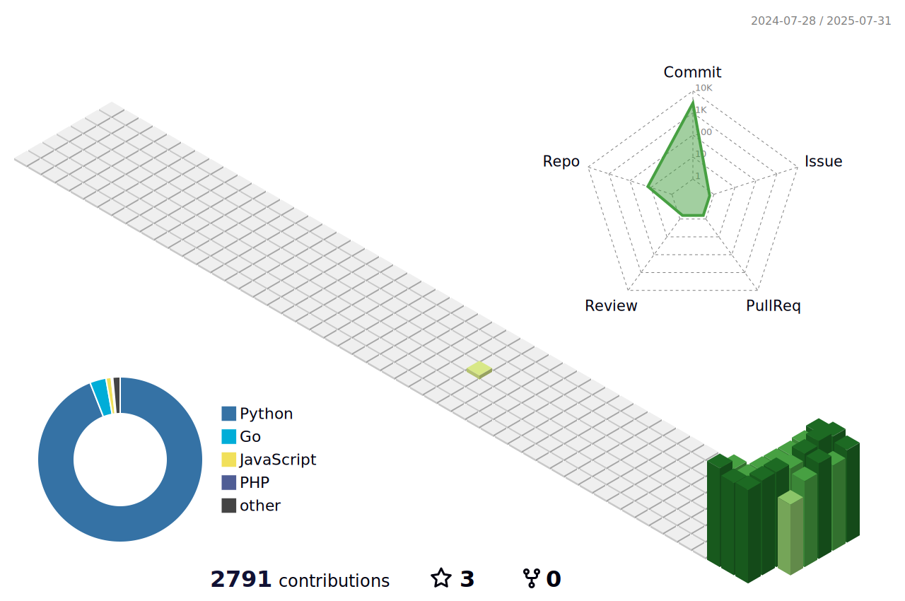

<!--
**tahmaseb73/Tahmaseb73** is a ✨ _special_ ✨ repository because its `README.md` (this file) appears on your GitHub profile.

Here are some ideas to get you started:

- 🔭 I’m currently working on ...
- 🌱 I’m currently learning ...
- 👯 I’m looking to collaborate on ...
- 🤔 I’m looking for help with ...
- 💬 Ask me about ...
- 📫 How to reach me: ...
- 😄 Pronouns: ...
- ⚡ Fun fact: ...
-->

<div align="center">
  <picture>
    <source media="(prefers-color-scheme: dark)" srcset="profile-3d-contrib/dark-theme.svg">
    <source media="(prefers-color-scheme: light)" srcset="profile-3d-contrib/light-theme.svg">
    
  </picture>
</div>

```
           ,ggg,                                     ad88888ba          a8   
          dP""8I                          ,dPYb,    d8"     "88       ,d88   
         dP   88                          IP'`Yb    88       88      a8P88   
        dP    88                          I8  8I    88       88    ,d8" 88   
       ,8'    88                          I8  8'    Y8,    ,d88   a8P'  88   
       d88888888    ,gggggg,    ,gggg,gg  I8 dPgg,   "PPPPPP"88 ,d8"    88   
 __   ,8"     88    dP""""8I   dP"  "Y8I  I8dP" "8I          88 888888888888 
dP"  ,8P      Y8   ,8'    8I  i8'    ,8I  I8P    I8          8P         88   
Yb,_,dP       `8b,,dP     Y8,,d8,   ,d8I ,d8     I8,8b,    a8P          88   
 "Y8P"         `Y88P      `Y8P"Y8888P"88888P     `Y8`"Y8888P'           88   
                                    ,d8I'                                    
                                  ,dP'8I                                     
                                 ,8"  8I                                     
                                 I8   8I                                     
                                 `8, ,8I                                     
                                  `Y8P"
```
